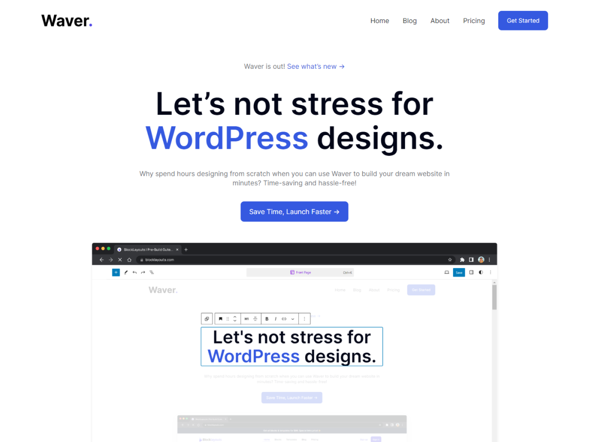

# Waver

Waver is more than just another WordPress theme – it's a game-changer for anyone looking to build professional-grade websites with ease.

## About

Waver, is a modern WordPress theme optimized for Full Site Editing, providing a library of pre-built blocks and layouts to create unique and professional websites.
Whether you're launching a blog, promoting your business, or showcasing your portfolio, Waver empowers you to create professional-grade websites that stand out from the crowd. Experience the future of WordPress with Waver!

## Requirements

- WordPress 6+
- PHP 7.3+

## Copyright

Copyright © 2023, Waver.
Waver is distributed under the terms of the GNU GPL.

This program is free software; you can redistribute it and/or
modify it under the terms of the GNU General Public License
as published by the Free Software Foundation; either version 2
of the License, or (at your option) any later version.

This program is distributed in the hope that it will be useful,
but WITHOUT ANY WARRANTY; without even the implied warranty of
MERCHANTABILITY or FITNESS FOR A PARTICULAR PURPOSE. See the
GNU General Public License for more details.

## Resources

### Fonts

- **Inter font**
  - License: (c) 2016 Rasmus, SIL
  - License URL: [Inter License](https://github.com/rsms/inter/blob/master/LICENSE.txt)

### Images

#### Avatars

- License: Fair Use License
- License URL: [Avatars License](https://uifaces.co/licenses)
- avatar-1.png - [Link](https://mighty.tools/mockmind-api/content/human/46.jpg)
- avatar-2.png - [Link](https://mighty.tools/mockmind-api/content/human/75.jpg)
- avatar-3.png - [Link](https://mighty.tools/mockmind-api/content/human/53.jpg)
- avatar-4.png - [Link](https://mighty.tools/mockmind-api/content/human/37.jpg)
- avatar-5.png - [Link](https://mighty.tools/mockmind-api/content/human/57.jpg)
- avatar-6.png - [Link](https://mighty.tools/mockmind-api/content/human/41.jpg)
- avatar-7.png - [Link](https://mighty.tools/mockmind-api/content/human/5.jpg)
- avatar-8.png - [Link](https://mighty.tools/mockmind-api/content/human/7.jpg)

#### Logos

- License: Fair Use License
- License URL: [Logos License](https://logoipsum.com/license/)
- Logo-1.png - [Link](https://logoipsum.com/artwork/325)
- Logo-2.png - [Link](https://logoipsum.com/artwork/264)
- Logo-3.png - [Link](https://logoipsum.com/artwork/297)
- Logo-4.png - [Link](https://logoipsum.com/artwork/253)
- Logo-5.png - [Link](https://logoipsum.com/artwork/286)

#### Other Images

- waver-notice-welcome.png, gradient.png, Placeholder.png, feature-1.png, quote-icon.png, waver.png, check.png - Created by Qara Yahya.
- License: CC0 1.0 Universal (CC0 1.0)
- License URL: [CC0 1.0 License](https://creativecommons.org/publicdomain/zero/1.0/)
